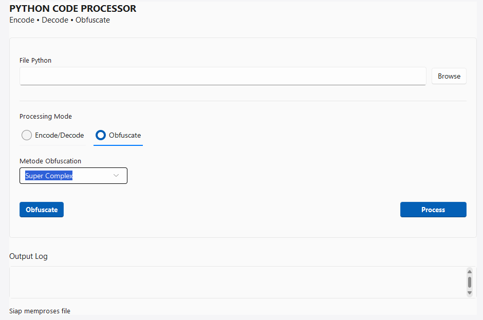

# PyGuardian - Python Code Protection Tool

 *(Tambahkan logo jika ada)*

## Deskripsi
PyGuardian adalah aplikasi desktop modern dengan tampilan "clean glass" yang dirancang untuk melindungi kode Python Anda. Aplikasi ini menyediakan tiga metode perlindungan:
1. **Encoding** - Melindungi kode dengan encoding reversibel (dapat didekode kembali)
2. **Decoding** - Mengembalikan kode yang sudah dienkode ke bentuk aslinya
3. **Obfuscation** - Melindungi kode dengan teknik obfuskasi yang tidak dapat didekode kembali

## Fitur Utama
- 📦 **Enkode multilayer** - Lindungi kode dengan hingga 5 lapisan enkoding
- 🔓 **Dekode otomatis** - Deteksi dan dekode file Python yang sudah dienkode
- 🛡️ **Tiga metode obfuskasi**:
  - **Marshal** - Obfuskasi dasar menggunakan marshal Python
  - **Strong Obfuscation** - Obfuskasi kuat dengan multiple enkripsi
  - **Super Complex** - Obfuskasi sangat kompleks dengan banyak lapisan proteksi
- 🎨 **UI Modern** - Tampilan clean glass dengan desain elegan
- 📱 **Intuitif** - Antarmuka sederhana dan mudah digunakan

## Screenshot
 *(Tambahkan screenshot aplikasi)*

## Persyaratan
- Python 3.7 atau lebih baru
- Modul tambahan:
  - sv-ttk (untuk tampilan modern)

## Instalasi
1. Clone atau download repository ini
2. Instal dependencies:

Developed by WONG © 1993
